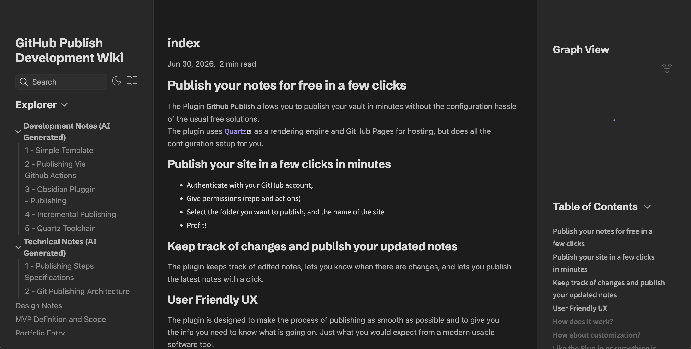

## Publish your notes for free in a few clicks
The Plugin allows you to publish your vault in minutes without the configuration and learning curve of the free solutions.
The plugin uses [Quartz](https://quartz.jzhao.xyz/) as a site generator and GitHub Pages for hosting, but does all the configuration setup for you.

### Easy steps:
- Authenticate with your GitHub account,
- Give permissions (public repo and actions)
- Select the folder you want to publish, and the name of the site
- Profit!


## GitHub Permissions
The plugin requires a few permissions from your GitHub account; those are the permissions and why we ask for them.
- **Public Repo**: We use this permission to create new repositories on your behalf, list existing public repositories, and create commits to upload content.
- **Workflow**: We use this to set up GitHub Actions that build the website when you publish new content.
We do not read any data from your repositories other than that, and the plugin does not delete repositories or touch data outside the content/ folder.
## Live Demo

Checkout the Wiki of the project that is published with the Quartz template.

[Example Wiki](https://oilandrust.github.io/githubpublish-wiki/)




## Keep track of changes and publish your updated notes
The plugin keeps track of your published sites, lets you know when there are changes, and lets you publish the latest notes with a click.


## Features

- **One-click setup** — choose a content folder, site name, and repository; the plugin handles the rest
- **Quartz by default** — Obsidian-flavored markdown, backlinks, and graph view out of the box
- **Incremental publishes** — only changed notes are uploaded after the initial publish
- **Multi-site** — publish several folders from one vault to separate repositories
- **Progress tracking** — monitors GitHub Actions until the site is live

## How it works

1. You authenticate with GitHub (device flow OAuth).
2. On first publish, the plugin creates a repo containing your notes under `content/`, a pinned [Quartz](https://quartz.jzhao.xyz/) toolchain, and a deploy workflow.
3. A commit to `main` triggers GitHub Actions, which builds `dist/` and deploys to GitHub Pages.
4. Later publishes diff your vault folder against a stored manifest and push only what changed.

## Configuration

The pluggin settings lets you edit Quartz configuration file in the settings. The configuration is published with the content when it changed and is applied on a new publish build.

This allows to chose and configure Quartz pluggins, themes, colors, analytics, etc.
More info about Quartz configuration can be found [here](https://quartz.jzhao.xyz/configuration).

## Enjoying the pluggin or missing some features?

Get in touch! The plugin is in an early prototype version, and I am curious to know what features you would like to see. Get in touch directly via email: orouiller@gmail.com.

## Some Issue?

Please report issues and bugs on the [GitHub Issue Page](https://github.com/oilandrust/obsidian-github-publish/issues)

## Install

Download the latest release, then install into your vault:

```
<vault>/.obsidian/plugins/github-publish/
```

**From the Obsidian community store:** install as usual — the Quartz toolchain is embedded in `main.js` and loaded in memory when you publish.

**From a GitHub release:** download `main.js`, `manifest.json`, and `styles.css` into your plugin folder. The Quartz toolchain is embedded in `main.js` — no separate `assets/` folder is required.

**For development:** symlink or copy this repository into your vault (after `npm run build:plugin`):

```
<vault>/.obsidian/plugins/github-publish/
```

The folder should contain `manifest.json`, `main.js`, and `styles.css`.

## Usage

| Command | Description |
|---------|-------------|
| **GitHub Publish: Set up site** | Wizard for a new published site |
| **GitHub Publish: Publish changes** | Push note updates (picks a site if you have several) |

Published sites appear as cards in the plugin settings, each with its own **Publish changes** button and live status.


If publish fails with an `UpdateRef` permissions error, disconnect and reconnect GitHub so your token includes the `workflow` scope.

## Deleting a published Site

The Pluggin currently do not implement deletion of site and repository. Please delete the repository on your GitHub account, you can find a link to it in the site status of the puggin settings.

## Telemetry

Published sites optionally report **anonymous usage counters** when their GitHub Pages deploy workflow runs (no user, vault, repository, or IP data):

- `publish` — first publish commit
- `update` — later content publishes

Counters are stored in a separate Cloudflare Worker (maintained locally, not in this repository).

## License

[MIT](LICENSE) © [oilandrust](https://github.com/oilandrust)
