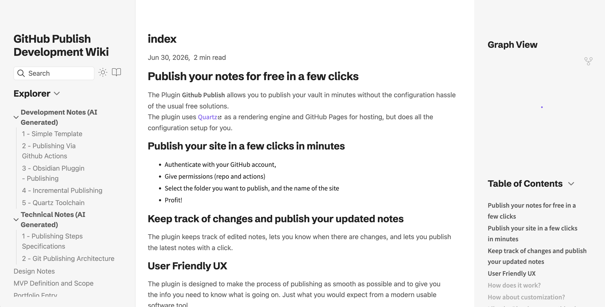
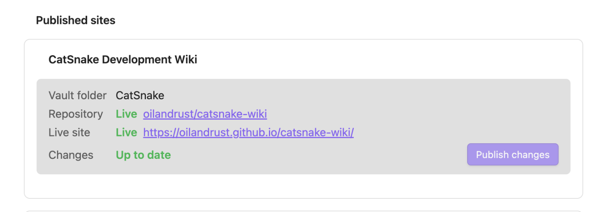

## Publish your notes for free in a few clicks
The Plugin **Github Publish** allows you to publish your vault in minutes without the configuration hassle of the usual free solutions.
The plugin uses [Quartz](https://quartz.jzhao.xyz/) as a rendering engine and GitHub Pages for hosting, but does all the configuration setup for you.

### Easy steps:
- Authenticate with your GitHub account,
- Give permissions (repo and actions)
- Select the folder you want to publish, and the name of the site
- Profit!

## Live Demo

Checkout the Wiki of the project that is published with the Quartz template.

[Example Wiki](https://oilandrust.github.io/githubpublish-wiki/)



## Keep track of changes and publish your updated notes
The plugin keeps track of your published sites, lets you know when there are changes, and lets you publish the latest notes with a click.




## Features

- **One-click setup** — choose a content folder, site name, and repository; the plugin handles the rest
- **Quartz by default** — Obsidian-flavored markdown, backlinks, and graph view out of the box
- **Incremental publishes** — only changed notes are uploaded after the initial publish
- **Multi-site** — publish several folders from one vault to separate repositories
- **Progress tracking** — monitors GitHub Actions until the site is live

## How it works

1. You authenticate with GitHub (device flow OAuth).
2. On first publish, the plugin creates a repo containing your notes under `content/`, a pinned [Quartz](https://quartz.jzhao.xyz/) toolchain, and a deploy workflow.
3. A commit to `main` triggers GitHub Actions, which builds `dist/` and deploys to GitHub Pages.
4. Later publishes diff your vault folder against a stored manifest and push only what changed.

## Enjoying the pluggin or missing some features?

Get in touch! The pluggin is in a early prototype version and I am curious to know what features you would like to see, get in touch directly via email: orouiller@gmail.com.

## Some Issue?

Please report issues and bugs on the [GitHub Issue Page](https://github.com/oilandrust/obsidian-github-publish/issues)

## Usage

| Command | Description |
|---------|-------------|
| **GitHub Publish: Set up site** | Wizard for a new published site |
| **GitHub Publish: Publish changes** | Push note updates (picks a site if you have several) |

Published sites appear as cards in the plugin settings, each with its own **Publish changes** button and live status.


If publish fails with an `UpdateRef` permissions error, disconnect and reconnect GitHub so your token includes the `workflow` scope.

## Deleting a published Site

The Pluggin currently do not implement deletion of site and repository. Please delete the repository on your GitHub account, you can find a link to it in the site status of the puggin settings.

## Development

Requirements: Node.js 20+ and npm.

```bash
git clone https://github.com/oilandrust/obsidian-github-publish.git
cd obsidian-github-publish
npm run build:plugin
```

| Script | Purpose |
|--------|---------|
| `npm run build:plugin` | Sync toolchains and build the plugin |
| `npm run build:plugin:advanced` | Build with extra settings (template engine, Quartz version) |
| `npm run sync:toolchain` | Refresh bundled Quartz and in-house toolchains |
| `npm run build` | Plugin only (assumes toolchains already synced) |

More detail: [plugin/README.md](plugin/README.md).

## License

[MIT](LICENSE) © [oilandrust](https://github.com/oilandrust)
