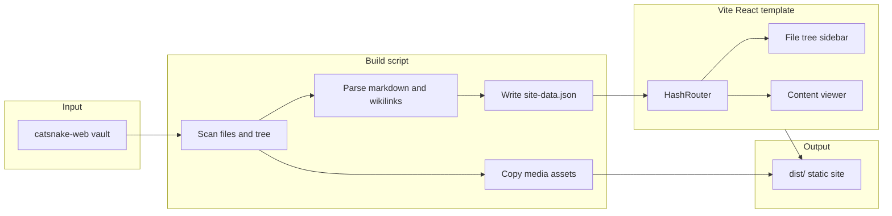

# Static Site Template + Build Script

## Goal

Ship the first validation step from [Wiki/MVP.md](Wiki/MVP.md): a **reusable web template** and a **build script** that turns vault notes into a static site. Test locally against the existing [catsnake-web](https://github.com/oilandrust/catsnake-web) vault at `/Users/olivier/Projects/catsnake-web` (13 notes, mixed media, wikilink embeds). GitHub Pages deployment comes in a follow-up phase.

## Architecture



**Pattern:** Same idea as your [portfolio-psy/build-portfolio.js](/Users/olivier/Projects/portfolio-psy/build-portfolio.js) — content preprocessing produces JSON + copied assets, then the frontend build runs. Here the UI is Obsidian-like (folder tree + document pane) instead of portfolio pages.

## Repository layout

Create this structure inside [obsidian-github-publish](obsidian-github-publish):

```
obsidian-github-publish/
  package.json                  # root scripts: build:demo, dev
  scripts/
    build-site.mjs              # orchestrator: content → json → vite build
    lib/
      scan-content.mjs          # walk vault, build tree, classify file types
      parse-markdown.mjs        # frontmatter strip, wikilinks, md → HTML
      resolve-asset.mjs         # resolve ![[...]] to vault-relative paths
  template/                     # Vite + React SPA (the publishable template)
    package.json
    vite.config.ts
    index.html
    public/
      data/                     # generated site-data.json (gitignored)
    src/
      App.tsx
      main.tsx
      types.ts                  # SiteData, TreeNode types shared conceptually with build
      components/
        Layout.tsx              # sidebar + main split
        FileTree.tsx            # collapsible folder tree
        ContentView.tsx         # note HTML or media viewer
      styles/
        obsidian.css            # dark theme, typography
  fixtures/                     # optional: pointer or submodule to catsnake-web
```

The **published user repo** (later, created by the plugin) will mirror this: `content/` for notes + `template/` + `scripts/` + generated `dist/`. For now we point the build script at the external catsnake-web path.

## Build script (`scripts/build-site.mjs`)

### CLI

```bash
node scripts/build-site.mjs \
  --content /Users/olivier/Projects/catsnake-web \
  --site-name "Cat Snake" \
  --base-path /catsnake-web/   # optional, for future GitHub project pages
```

### Steps

1. **Scan** the content directory recursively.
   - Include: `.md`, images (`.png`, `.jpg`, `.gif`, `.webp`), `.pdf`, `.mp3`
   - Exclude: `.git`, `.obsidian`, `.DS_Store`, `.canvas` (skip for MVP), `*.excalidraw.md` (treat as plain markdown or skip — recommend skip with a build warning)

2. **Build a file tree** preserving folder hierarchy for the sidebar.

3. **Parse each markdown note:**
   - Strip optional YAML frontmatter (only Excalidraw notes in catsnake-web have it)
   - Convert standard markdown with `marked` (or `remark`/`rehype` if you prefer AST transforms)
   - Transform Obsidian embeds before markdown parse:
     - `![[file.png]]` → ``
     - `![[file.png|400]]` → ``
   - Resolve wikilinks relative to the note's directory, then fall back to vault-wide basename search (handles catsnake-web cases like `![[Pasted image 20260620143430.png]]` co-located with the note)
   - Log warnings for unresolved links (e.g. stale `![[Cat Snake/Wiki/...]]` paths in the devlog) — render a visible broken-link placeholder in HTML

4. **Copy assets** into `template/public/assets/` mirroring vault-relative paths.

5. **Write `template/public/data/site-data.json`:**

```json
{
  "siteName": "Cat Snake",
  "basePath": "/",
  "tree": [
    {
      "type": "folder",
      "name": "Design",
      "children": [
        { "type": "note", "id": "design-specs", "path": "Design/specs.md", "title": "specs", "html": "<h1>...</h1>" },
        { "type": "asset", "id": "design-art-cat-1", "path": "Design/Art/12b7d52b-....png", "mime": "image/png" }
      ]
    }
  ]
}
```

6. **Run `vite build`** from `template/` with `base` set from `--base-path` (important for GitHub project pages later).

### Root `package.json` scripts

- `npm run build:demo` — build using catsnake-web path
- `npm run dev` — build demo data once, then `vite dev` in template
- `npm run preview` — serve `template/dist/` locally with `vite preview`

## Web template (Vite + React)

### Routing

Use **HashRouter** (`#/Design/specs`) so GitHub Pages works without a 404 fallback config. Each tree node gets a stable `id` slug derived from its vault path.

### UI (matches MVP spec)

| Area | Behavior |
|------|----------|
| Left sidebar | Collapsible folder tree; notes and assets listed together |
| Main pane | Rendered HTML for notes; ``, `<video>`, `<audio>`, or embedded `<iframe>` for PDFs |
| Theme | Dark, Obsidian Publish-inspired (dark bg, muted sidebar, readable prose) |
| Out of scope | Right panel, search, canvas/excalidraw viewer |

### Key components

- **`Layout`** — CSS grid or flex: fixed-width sidebar (~260px) + scrollable main area
- **`FileTree`** — recursive tree; highlight active route; folders toggle open/closed (default: expand all top-level folders)
- **`ContentView`** — switch on node type: `note` renders pre-built HTML inside a prose container; `asset` renders media directly

### Styling

Start with a small custom CSS file (`obsidian.css`) using CSS variables for colors. No component library needed for MVP — keeps the template easy to clone into user repos.

## catsnake-web test expectations

After `npm run build:demo && npm run preview`, verify:

- All 13 markdown notes appear in the sidebar under correct folders
- [DevLog - 2026-06-19.md](/Users/olivier/Projects/catsnake-web/DevLog/2026-06-19/DevLog%20-%202026-06-19.md) renders with local GIF and PNG embeds resolved
- [Cat styles.md](/Users/olivier/Projects/catsnake-web/Design/Art/Cat%20styles.md) shows 5 UUID-named PNGs
- Broken cross-vault wikilink shows a warning placeholder (not a crash)
- PDFs and MP3s appear in the tree and open in the main viewer
- `.canvas` files are excluded from the tree

## Dependencies (minimal)

**Root / build script:** `marked`, `js-yaml` (frontmatter), Node built-ins only otherwise

**Template:** `react`, `react-dom`, `react-router-dom`, `vite`, `@vitejs/plugin-react`, `typescript`

## What comes next (out of scope for this plan)

Documented in MVP validation steps — not built now:

1. **GitHub Actions** workflow: on push to `main`, run `build-site.mjs`, deploy `dist/` to GitHub Pages
2. **`base-path` wiring** for `username.github.io/repo-name` URLs
3. **Obsidian plugin** onboarding that copies vault content + template into a user repo and opens a PR

## Implementation order

1. Scaffold `template/` Vite app with Layout, FileTree, ContentView reading hardcoded mock JSON
2. Implement `scan-content.mjs` + `site-data.json` generation (no markdown yet — tree only)
3. Implement `parse-markdown.mjs` with wikilink resolution and asset copying
4. Wire `build-site.mjs` orchestrator + root npm scripts
5. Style dark Obsidian theme and polish sidebar interactions
6. Run full build against catsnake-web and fix edge cases (broken links, width aliases, co-located assets)
