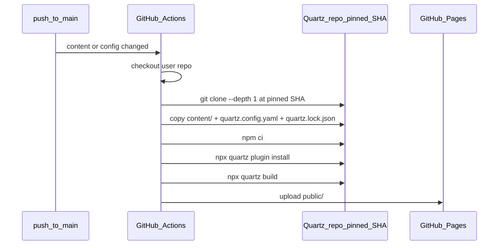

# Quartz template engine support

## Recommendation: thin repo + CI clone (not vendoring Quartz)

Cloning Quartz **during GitHub Actions** (not during Obsidian publish) is the practical production approach:

| Approach | Verdict |
|----------|---------|
| Vendor full Quartz tree into user repo on publish | Huge initial commit (~thousands of files via Git API); hard to upgrade |
| Clone Quartz inside Obsidian at publish time | Slow, needs local git/network in plugin; fragile |
| **Thin user repo + CI clones pinned Quartz commit** | Small repo; incremental `content/**` publish unchanged; pin core via SHA |

**User repo layout (Quartz engine):**

```
content/                      # vault notes (incremental publish target)
quartz.config.yaml            # generated from obsidian template
quartz.lock.json              # plugin pins (generated at sync time)
.github-publish/site.json     # { templateEngine, quartzCommitSha, siteName, repo }
.github/workflows/deploy.yml  # clones Quartz at pinned SHA, builds, deploys
```

**CI build flow:**



**Quartz versioning reality:** v5 has no npm package and no semver release tags. Pin by **commit SHA** on branch `v5` (not `v5.x` tags). Plugin ships a tested default SHA; advanced settings allow override.

**Node requirement:** Quartz v5 CI uses Node 22+ (official docs use 24). Update workflow from current Node 20.

---

## Naming and defaults

Per your preference: **no setup wizard picker for now**.

| Internal ID | UI label | Default |
|-------------|----------|---------|
| `quartz` | Quartz | **Yes (ship default)** |
| `inhouse` | Built-in | Advanced settings only |

Add to [`plugin/src/settings.ts`](plugin/src/settings.ts):

```ts
export type TemplateEngine = 'quartz' | 'inhouse';

export interface PluginSettings {
  templateEngine: TemplateEngine;      // default 'quartz'
  quartzCommitSha: string | null;      // null → use plugin DEFAULT_QUARTZ_COMMIT
  // ...
}

export interface SetupConfig {
  templateEngine?: TemplateEngine;     // inherited from settings at publish time
  quartzCommitSha?: string | null;
  // existing fields...
}
```

Published repo marker [`.github-publish/site.json`](plugin/assets/toolchain-quartz/.github-publish/site.json) records which engine + SHA was used (for support and future upgrade commands).

---

## Asset delivery: two bundled toolchains

Restructure plugin assets:

```
plugin/assets/
  toolchain-inhouse/     # current bundled Vite/React (rename from toolchain/)
  toolchain-quartz/      # minimal Quartz bootstrap files only
```

### Inhouse engine (unchanged behavior)

- Rename current [`plugin/assets/toolchain/`](plugin/assets/toolchain/) → `toolchain-inhouse/`
- [`scripts/sync-toolchain.mjs`](scripts/sync-toolchain.mjs) continues syncing root `template/` + `scripts/` into `toolchain-inhouse/`
- [`plugin/src/publish/bundleToolchain.ts`](plugin/src/publish/bundleToolchain.ts) loads manifest from engine-specific dir

### Quartz engine (new)

Add [`scripts/sync-quartz-toolchain.mjs`](scripts/sync-quartz-toolchain.mjs) that:

1. Clones `https://github.com/jackyzha0/quartz.git` at `DEFAULT_QUARTZ_COMMIT` (env-overridable)
2. Runs `npm ci` + `npx quartz create --template obsidian --strategy new` in a temp dir
3. Extracts and templates:
   - `quartz.config.yaml` — substitute `{{pageTitle}}`, `{{baseUrl}}` (`owner.github.io/repo`)
   - `quartz.lock.json` — from `npx quartz plugin install` output
   - `.github/workflows/deploy.yml` — Quartz-specific workflow with `{{quartzCommitSha}}`
   - `.github-publish/site.json.template`
   - `.gitignore`
4. Writes `manifest.json` listing files to push on initial publish

**We do not vendor the Quartz engine** into the plugin or user repo — only config + lock + workflow (~5 files).

Update root [`package.json`](package.json):

```json
"sync:toolchain": "node scripts/sync-toolartz-toolchain.mjs && node scripts/sync-quartz-toolchain.mjs",
"build:plugin": "npm run sync:toolchain && npm run build --prefix plugin"
```

Ship `DEFAULT_QUARTZ_COMMIT` in [`plugin/src/quartz/versions.ts`](plugin/src/quartz/versions.ts) with a short list of known-good SHAs for the advanced settings dropdown.

---

## Quartz CI workflow (generated)

Replace inhouse `npm ci + build-site.mjs` with something like:

```yaml
# Key steps (full file generated by sync-quartz-toolchain.mjs)
- uses: actions/checkout@v4
  with:
    fetch-depth: 0          # git dates plugin

- uses: actions/setup-node@v4
  with:
    node-version: '22'
    cache: npm
    cache-dependency-path: quartz-engine/package-lock.json

- name: Clone Quartz engine
  run: |
    git clone --depth 1 https://github.com/jackyzha0/quartz.git quartz-engine
    cd quartz-engine && git checkout {{quartzCommitSha}}

- name: Overlay user site
  run: |
    cp -r content quartz-engine/content
    cp quartz.config.yaml quartz.lock.json quartz-engine/

- run: npm ci
  working-directory: quartz-engine
- run: npx quartz plugin install
  working-directory: quartz-engine
- run: npx quartz build
  working-directory: quartz-engine

- uses: actions/upload-pages-artifact@v3
  with:
    path: quartz-engine/public
```

Note: official Quartz hosting docs omit `configure-pages`; our plugin already calls [`enableGitHubPages`](plugin/src/github/pages.ts) before first push — keep that.

---

## Plugin code changes

### 1. Bundle loader

Refactor [`bundleToolchain.ts`](plugin/src/publish/bundleToolchain.ts) → `loadPublishToolchainFiles(engine, pluginDir, config)`:

- `inhouse` → current manifest + `package.json.template` substitution
- `quartz` → quartz manifest + substitute `{{pageTitle}}`, `{{baseUrl}}`, `{{quartzCommitSha}}`, `{{siteName}}`, `{{repo}}`

### 2. Initial publish

[`initialPublish.ts`](plugin/src/publish/initialPublish.ts): pass `config.templateEngine ?? settings.templateEngine` to loader. Log engine + SHA.

### 3. Incremental publish

[`publishChanges.ts`](plugin/src/publish/publishChanges.ts): **no change** — still only diffs `content/**` for both engines.

### 4. Settings UI

[`plugin/main.ts`](plugin/main.ts) advanced section (collapsed or below OAuth):

- **Template engine:** dropdown Quartz / Built-in (default Quartz)
- **Quartz version:** dropdown of tested SHAs + "Custom SHA" text field (only when engine = quartz)
- Published site summary: show engine + pinned SHA from settings / `site.json`

No wizard step changes (per your choice).

### 5. Validation spike (first implementation task)

Before full UI, run a manual spike:

1. Create test repo with thin Quartz layout via script
2. Push via existing Git API flow
3. Confirm Actions build succeeds and Pages serves the site
4. Confirm incremental content-only publish triggers rebuild

Document result + chosen default SHA in [`Wiki/Development Notes/`](Wiki/Development Notes/).

---

## Content scanning adjustments

[`scanVault.ts`](plugin/src/publish/scanVault.ts) already excludes `.obsidian`, `.excalidraw.md`, etc. For Quartz:

- Keep publishing vault files as `content/<relative-path>` (Quartz expects `content/` at repo root)
- Quartz lowercases/hyphenates URLs — `alias-redirects` plugin is included in obsidian template; no plugin change needed for MVP
- Optional follow-up: align ignore patterns with Quartz `ignorePatterns` in config

---

## Migration and compatibility

- **Existing published sites** (inhouse layout with `scripts/` + `template/`): detect via absence of `.github-publish/site.json` or `templateEngine: inhouse`; continue working unchanged
- **New publishes:** default to Quartz
- **Switching engines on existing repo:** out of scope for v1 (would require full republish / new repo)

---

## Risks and mitigations

| Risk | Mitigation |
|------|------------|
| Quartz `v5` branch moves; pinned SHA becomes incompatible | Ship SHA list with plugin releases; test in spike; allow SHA override in settings |
| `npx quartz plugin install` needs network in CI | Cache `.quartz/plugins` keyed on `quartz.lock.json` |
| Build slower than inhouse Vite | Acceptable tradeoff for Obsidian fidelity; document in dev notes |
| Plugin install step fails on first deploy | Generate `quartz.lock.json` at sync time with all obsidian-template plugins resolved |

---

## Files to add/change (summary)

| File | Change |
|------|--------|
| [`scripts/sync-quartz-toolchain.mjs`](scripts/sync-quartz-toolchain.mjs) | **New** — clone Quartz, generate config/lock/workflow |
| [`scripts/sync-toolchain.mjs`](scripts/sync-toolchain.mjs) | Output to `toolchain-inhouse/` |
| [`plugin/src/quartz/versions.ts`](plugin/src/quartz/versions.ts) | **New** — `DEFAULT_QUARTZ_COMMIT`, tested SHA list |
| [`plugin/src/publish/bundleToolchain.ts`](plugin/src/publish/bundleToolchain.ts) | Engine-aware loading |
| [`plugin/src/settings.ts`](plugin/src/settings.ts) | `TemplateEngine`, settings fields |
| [`plugin/main.ts`](plugin/main.ts) | Advanced template settings UI |
| [`plugin/src/publish/initialPublish.ts`](plugin/src/publish/initialPublish.ts) | Pass engine to bundler |
| [`plugin/README.md`](plugin/README.md) | Document engines + SHA pinning |
| [`Wiki/Publish Architecture.md`](Wiki/Publish Architecture.md) | Document dual-engine model |
